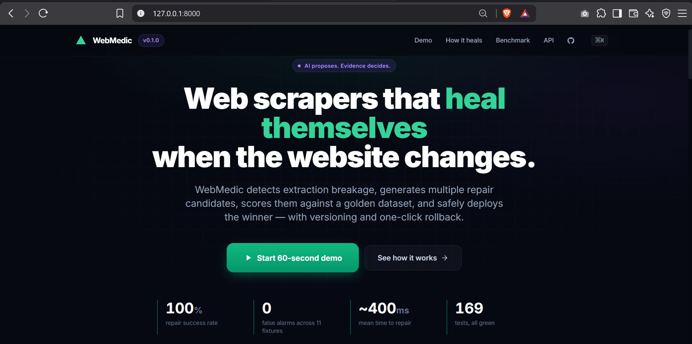
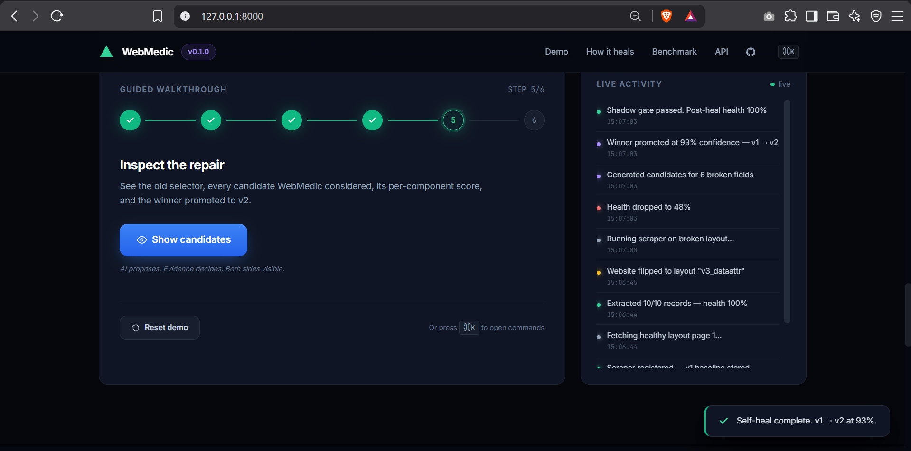
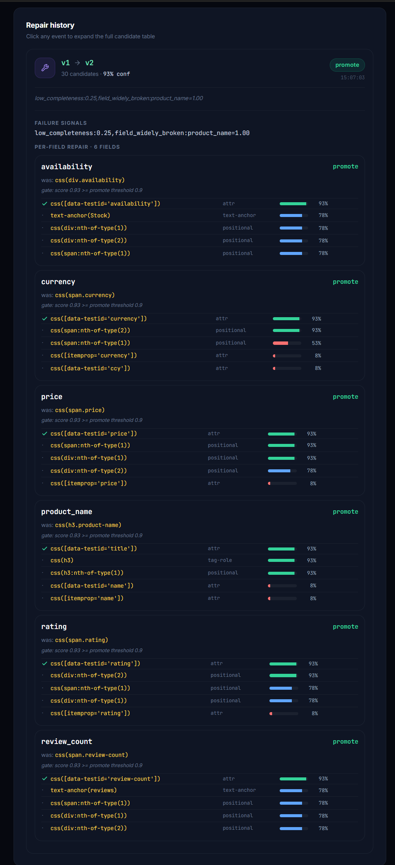
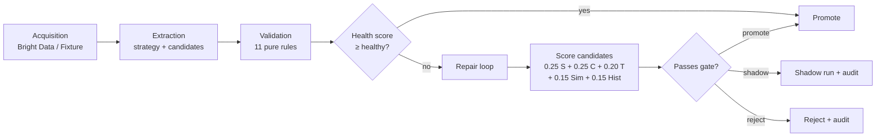

# WebMedic — self-healing web scrapers


> A scraper that detects its own breakage, generates repair candidates,
> validates them against a golden dataset, and safely deploys the best
> verified strategy — with versioning and rollback baked in.
>
> **AI proposes. Evidence decides.**



|  |  |
|:-:|:-:|
| *Dashboard after a heal — health score back to green.* | *Repair event expanded — five candidates scored, one promoted.* |

## Quick start

```
git clone https://github.com/gundujeevesh123/webmedic-scrapeverse.git
cd webmedic-scrapeverse
pip install -e ".[dev]" --break-system-packages
pytest -q                                        # 169 tests
uvicorn backend.api.app:app --port 8000 --reload # dashboard on :8000
```

Open <http://127.0.0.1:8000> and press **Start 60-second demo**.

## Architecture



## Style checks

```
ruff check backend/       # lint + import sort
black --check backend/    # formatting
mypy backend/             # types
pytest -q --cov=backend --cov-fail-under=85
```

WebMedic is the ScrapeVerse hackathon submission built from the guide
*Self-Healing Web Scraping — Complete Learning Guide, Winning Strategy & Hackathon Workflow.*
It is deliberately small: the goal is not to build the largest scraper,
it is to build the smallest system that convincingly proves a scraper can
survive a real website change.

---

## What the demo proves

Across 11 controlled-breakage layouts of the same fictional storefront
(`MetroKart`, 20 products, both pages), a WebMedic scraper compared with a
traditional selector-based scraper:

|  System      | Runs | Healthy | Field accuracy | Completeness | Repairs | False repairs | MTTR   |
| ------------ | :--: | :-----: | :------------: | :----------: | :-----: | :-----------: | :----: |
| Traditional  | 11   |  7 / 11 |    89.77 %     |    89.77 %   |    —    |       0       |   —    |
| **WebMedic** | 11   | 11 / 11 |   **100.00 %** |  **100.00 %**| **4/4** |     **0**     | ~400 ms |

**Detector:** precision 1.00 · recall 1.00 · F1 1.00 (4 TP · 7 TN · 0 FP · 0 FN).

The four breakages that killed the traditional scraper were:

- `v2_rename_class`   — `.price` renamed to `.cost`
- `v3_dataattr`       — class identifiers replaced with `[data-testid="…"]`
- `v9_combined`       — v2 + v4 nesting + a struck-through decoy price
- `v10_partial`       — availability class swapped, rest stable

WebMedic detected each failure from a health-score collapse, generated
candidate selectors from six sources, scored them against the golden
dataset, and promoted the winning strategy after a shadow run passed the
gate — every repair versioned in SQLite, every version rollback-able.

Numbers are reproducible: `python -m benchmark.harness --out benchmark/results/latest.json`.
Every metric is defined in [`benchmark/METHODOLOGY.md`](benchmark/METHODOLOGY.md)
and independently re-verified in `tests/integration/test_benchmark_verify.py`
(any divergence between the harness and the reference implementation makes
tests fail).

---

## The core mental model (from the guide, §25)

    HTML → DOM → selectors → structured data → normalization → validation
        → health monitoring → change detection → repair candidates
        → candidate testing → scoring → safe deployment → versioning + rollback
        → continuous monitoring.

WebMedic implements every step of that pipeline. The dashboard and demo CLI
visualize the full loop end-to-end.

---

## Architecture overview

Four layers, one process (guide §5, §20 — no unnecessary microservices):

```
      ┌──────────────────────┐
      │  Acquisition         │  fixture provider (default) OR Bright Data Web
      └──────────┬───────────┘  Unlocker proxy — same `fetch(url) → HTML` API.
                 ▼
      ┌──────────────────────┐
      │  Extraction Engine   │  Strategy = record_selector + per-field
      └──────────┬───────────┘  FieldSelectors (css / xpath / text-anchor / …)
                 ▼                → normalizer → schema-shaped records.
      ┌──────────────────────┐
      │  Validator + Health  │  8 pure rules + weighted health score
      └──────────┬───────────┘  H = 0.30·C + 0.30·V + 0.20·S + 0.20·R.
                 │
       PASS  ────┴──── FAIL
        ▼               ▼
     Store           Repair Engine ──┐
                        │            ▼
                        │      Candidate generator (6 sources)
                        │            │
                        │            ▼
                        │      Deterministic scorer §8.4
                        │            │
                        │            ▼
                        │      Shadow-run + confidence gate
                        │            │
                        │            ▼
                        └──►   Versioned promotion + rollback
```

Full architecture write-up: [`docs/ARCHITECTURE.md`](docs/ARCHITECTURE.md).
Repair engine deep dive: [`docs/repair-engine.md`](docs/repair-engine.md).
Design decisions: [`docs/adr/`](docs/adr/).

---

## Repo layout

    self-healing-scraper/
    ├── backend/
    │   ├── acquisition/     Bright Data adapter + local fixture provider + factory
    │   ├── api/             FastAPI app + interactive demo CLI
    │   ├── database/        SQLite store (scrapers, versions, runs, repair_events)
    │   ├── healer/          Candidate generator + repair orchestrator
    │   ├── scoring/         Guide §8.4 scoring formula
    │   ├── scraper/         Schema + strategy + extractor + normalizer
    │   ├── validator/       Rules + health scoring + failure signals
    │   └── versioning/      Deployment orchestrator (register / run / rollback)
    ├── frontend/            Single-page Tailwind dashboard
    ├── tests/
    │   ├── fixtures/        Golden dataset + 11 fixture layouts (both pages)
    │   ├── unit/            Extractor, validator, healer, acquisition tests
    │   └── integration/     Deploy, API, benchmark, end-to-end tests
    ├── benchmark/           Controlled-breakage harness + latest results
    ├── docs/                Architecture, repair engine, ADRs, submission checklist
    ├── outputs/             Dashboard screenshots (hero, healed, repair drill-down)
    ├── scripts/             Manual repair demonstration
    ├── examples/            Sample structured output (Product schema)
    ├── requirements.txt
    ├── pyproject.toml
    └── README.md            (this file)

---

## Quick start

```bash
# 1) Install
python3 -m venv .venv && source .venv/bin/activate
pip install -r requirements.txt

# 2) Regenerate the fixture layouts (idempotent)
python tests/fixtures/generate_fixtures.py

# 3) Run the tests
pytest -q                             # 61 tests, ~18 s

# 4) Run the benchmark harness
python -m benchmark.harness           # prints table + JSON summary

# 5) Run the interactive demo CLI (colored terminal story)
python -m backend.api.demo_cli --break v3_dataattr

# 6) Or start the dashboard
uvicorn backend.api.app:app --reload --port 8000
# then open http://127.0.0.1:8000/
```

The dashboard has a "Simulate site change" control that hot-swaps the served
fixture layout for the registered scraper. Click it, then click "Run" — you
will see the health score collapse, the candidate generator find the correct
new selectors, and the promoted version take over. Rollback is one click.

---

## Bright Data integration

Bright Data Scraper Studio / Web Unlocker is a first-class provider in the
acquisition layer.

Copy `.env.example` to `.env` and fill in your credentials:

    ACQUISITION_PROVIDER=brightdata
    BRIGHTDATA_USERNAME=brd-customer-<customer_id>-zone-<zone>
    BRIGHTDATA_PASSWORD=<zone_password>
    BRIGHTDATA_HOST=brd.superproxy.io
    BRIGHTDATA_PORT=33335
    BRIGHTDATA_ZONE=<zone_name>

When creds are absent WebMedic logs a warning and falls back to the local
fixture provider — the tests and the demo therefore run on a clean clone
without any account, and the same code path handles real acquisition when
you flip the env var. See [`backend/acquisition/`](backend/acquisition/).

---

## The self-healing loop, in one paragraph

Every scraper run produces a `HealthReport`. If health drops below the
`repair_required` threshold, `broken_fields_from_health()` identifies which
fields are widely broken. The healer emits candidate `FieldSelector`s from
six sources — stable attributes (`data-testid`/`data-*`/`itemprop`),
class-name synonyms, tag+role heuristics, text anchors, positional fallbacks,
and previously-successful selectors. Each candidate is *tested* (the strategy
is swapped in and re-extracted) and *scored* against the guide's formula:
`0.25·SchemaValidity + 0.25·Completeness + 0.20·TypeValidity + 0.15·Similarity + 0.15·Historical`.
The winning candidate per field is only *promoted* when it clears the confidence,
completeness, and schema floors AND its shadow run on the same page passes
the healthy threshold — otherwise it stays in *shadow* mode or is rejected.
Every decision is written to `scraper_versions` and `repair_events` so it is
auditable and one write away from rollback.

---

## Failure simulation

Every fixture under `tests/fixtures/pages/` is a controlled breakage:

| Fixture             | What changes                                                  |
| ------------------- | ------------------------------------------------------------- |
| v1_healthy          | baseline                                                      |
| v2_rename_class     | `.price` → `.cost`                                            |
| v3_dataattr         | classes replaced with `[data-testid="…"]`                     |
| v4_change_nesting   | every field wrapped in an extra div                           |
| v5_move_price       | price moved to a sibling summary block                        |
| v6_label_change     | visible labels change ("Rated" / "ratings" / "Buy for")       |
| v7_decoy            | struck-through "was" price above the current price            |
| v8_pagination       | `.next` link becomes `.load-more` under `.pager`              |
| v9_combined         | rename + nesting + decoy in one page                          |
| v10_partial         | only availability field breaks; the rest stays stable         |
| v11_semantic        | availability wording changes ("Available" instead of "In Stock") |

To add your own: edit `tests/fixtures/generate_fixtures.py` and rerun it.

---

## AI-use disclosure

WebMedic uses a heuristic candidate-generator as its "AI" layer. The scorer
and validator are fully deterministic. The default strategy was designed by
humans (co-authored with Claude Code). A pluggable LLM reasoner is a natural
extension — the `Candidate` interface is intentionally generic — but deployment
decisions are always controlled by deterministic validation against the golden
dataset. No candidate is promoted without evidence.

**AI proposes. Evidence decides.**

---

## Team

- Author: Gundu Jeevesh Laahiri
- Tooling: Claude Code (AI pair-programmer)
- Data: fully synthetic MetroKart storefront — no real websites are scraped
  by any of the tests, benchmarks, or demos.

---

## License

MIT — see [`LICENSE`](LICENSE).
